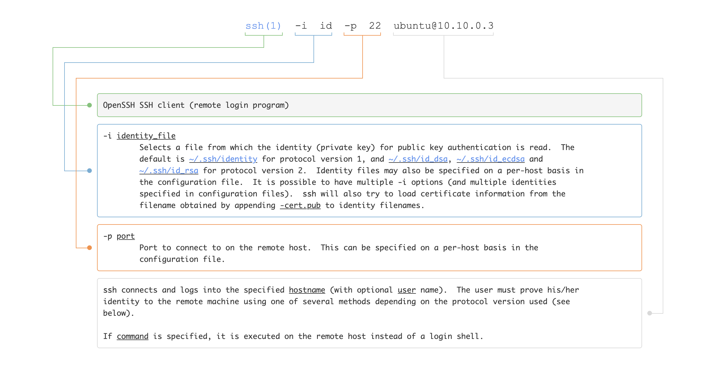

- [Effective usage of OpenSSH client suite](#effective-usage-of-openssh-client-suite)
  - [Intro](#intro)
  - [Setting up the environment](#setting-up-the-environment)
  - [Accessing client](#accessing-client)
  - [Scenario 1 - Logging into an SSH Server](#scenario-1---logging-into-an-ssh-server)
    - [Manual way](#manual-way)
    - [Using SSH Config file](#using-ssh-config-file)
      - [**Lets add a new host**](#lets-add-a-new-host)
      - [**Add a hostname or ip address for that host**](#add-a-hostname-or-ip-address-for-that-host)
      - [**Add a username**](#add-a-username)
      - [**Add SSH keys/identities to config**](#add-ssh-keysidentities-to-config)
      - [**Add more useful configurations**](#add-more-useful-configurations)
      - [Final output](#final-output)
      - [Using our custom config file](#using-our-custom-config-file)
    - [Let's go through SSH client configuration options](#lets-go-through-ssh-client-configuration-options)
    - [SSH Agent](#ssh-agent)
      - [**Run ssh-agent**](#run-ssh-agent)
      - [Add keys to ssh-agent](#add-keys-to-ssh-agent)
  - [Scenario 2 - Copying files between machines over SSH](#scenario-2---copying-files-between-machines-over-ssh)
    - [Copying a folder from the server to client](#copying-a-folder-from-the-server-to-client)
    - [Copying a folder from the client to server](#copying-a-folder-from-the-client-to-server)
  - [Scenario 2 - SSH via Jump host / bastion host](#scenario-2---ssh-via-jump-host--bastion-host)
    - [Manual way](#manual-way-1)
    - [Using SSH config](#using-ssh-config)
  - [Scenario 1 - SSH Port forwarding](#scenario-1---ssh-port-forwarding)
    - [Local Port forwarding](#local-port-forwarding)
  - [Dynamic forwarding](#dynamic-forwarding)
    - [Dynamic forwading - DEMO](#dynamic-forwading---demo)
    - [Dynamic forwading - Exercise](#dynamic-forwading---exercise)


# Effective usage of OpenSSH client suite

## Intro

This is a beginner level session to train you into using `OpenSSH` client suite effectively.

> [OpenSSH](https://www.openssh.com/) is an opensource implmentation of the SSH protocol

We will not delve into OpenSSH server side tools or configuration in this session.

The tools that we will cover include: 

- `ssh`
- `scp`
- `rsync`


## Setting up the environment

1. Install docker and docker compose on your system
2. Clone the repo `git clone https://github.com/0xbharath/Effective-OpenSSH-Client-Usage-Workshop.git`
3. Change the directory to "labs" `cd Effective-OpenSSH-Client/labs`
4. Spin up the labs using `docker-compose up`
5. Once the session is over, you can run `docker compose down` to remove the resources created

## Accessing client


Let's get shell access to the "ssh-client" machine using the following command - 

```bash
docker exec -it ssh-client sh
```

- You'll be working from inside this docker container with OpenSSH client and other tools installed. For this session, consider this docker container as base machine. 
- You'll by default get into the directory `workshop-files`. This is the directory where all the files necessary for the session are located.

## Scenario 1 - Logging into an SSH Server


Let's SSH into `ssh-serv1` (10.10.0.3) from our `ssh-client` machine (10.10.0.2)

To be able to SSH you need the following details - 

1. SSH Client software (Installed on `ssh-client machine`)
2. Username that you are trying to login as on the SSH server (In this case, `ubuntu`)
3. Hostname/IP address of that server (In this case, `10.10.0.3`)
4. Port number on which the SSH service is listening on the server (In this case, `22`)
4. Password or Private key associated with the username you are trying to login as (file named `id` in `workshop-files` directory)

### Manual way

<span style="color:#89cdd3">
Run any of the following two commands on the `ssh-client` docker
</span>


```bash
ssh -i id ubuntu@10.10.0.3
```

```bash
ssh -i id -p 22 -l ubuntu 10.10.0.3
```



> If you want any command in this session explained further, you can paste it into https://explainshell.com/

### Using SSH Config file

OpenSSH client parameters can be provided in three different ways (this is also the order of precedence when same value is provided via multiple ways. Command line args have highest priority) - 

1. Command line arguments
2. User-specific configuration file `~/.ssh/config` or custom config files
3. Global config file `/etc/ssh/ssh_config`

> More details on config file - [https://www.ssh.com/academy/ssh/config](https://www.ssh.com/academy/ssh/config)

Let's create a custom SSH client config file - 

1. Open your favourite text editor (ofcourse, `nano`) and create a new file called `custom-ssh-config`

This is a simple text file. Configurations can be on a per-host basis.

#### **Lets add a new host**

```bash
Host ssh-serv1
```

While it is not required, convention is to indent the various server blocks.

#### **Add a hostname or ip address for that host**

```bash
Host ssh-serv1
    Hostname 10.10.0.3
```

#### **Add a username**

```bash
Host ssh-serv1
    Hostname 10.10.0.3
    User ubuntu
```

#### **Add SSH keys/identities to config**

```bash
    Host ssh-serv1
        Hostname 10.10.0.3
        User ubuntu
        IdentityFile ./id
```

#### **Add more useful configurations**

The following two parameters are good-to-add but not mandatory. They are primarily to ensure that our connection stays alive for long we can add the following two configuration options. These options are particularly useful when working when the connectivity is unstable.

- `ServerAliveInterval 30`
- `ServerAliveCountMax 10`

The following parameters make it relatively secure and easy to manage the SSH identity files.

- `IdentitiesOnly yes` (Use only the configured SSH identity key)
- `AddKeysToAgent yes` (Add keys to the agent as required on first connection)

#### Final output

```bash
Host ssh-serv1
    Hostname 10.10.0.3
    User ubuntu
    IdentityFile ./id
    ServerAliveInterval 30
    ServerAliveCountMax 10
    IdentitiesOnly yes
    AddKeysToAgent yes
```

#### Using our custom config file

```bash
ssh -F custom-ssh-config ssh-serv1
```

If you wanted to add all the options to the original command line this is what the command would look like

```bash
ssh -l ubuntu 10.10.0.3 -o ServerAliveInterval=30 -o ServerAliveCountMax=10 -o IdentitiesOnly=yes -o AddKeysToAgent=yes
```

### Let's go through SSH client configuration options

```bash
man 5 ssh_config
```

### SSH Agent

The `ssh-agent` is a helper program that keeps track of users' identity keys and their passphrases. Simply put, ssh-agent will remember your keys and passphrases till we reboot the system.


#### **Run ssh-agent**

Run the following command to run `ssh-agent`

```bash
eval `ssh-agent`
```

#### Add keys to ssh-agent

The `ssh-add` command is used for adding identities to the agent. 

```bash
ssh-add /workshop-files/id
```

To list all the added identities

```bash
ssh-add -l
```

To delete an identity so that we get asked for the passphrase again

```bash
ssh-add -d /workshop-files/id
```

## Scenario 2 - Copying files between machines over SSH

`scp` is a program for copying files between machines over SSH protocol. 

> More details on scp at [https://www.ssh.com/academy/ssh/scp](https://www.ssh.com/academy/ssh/scp)

### Copying a folder from the server to client

```bash
scp -F custom-ssh-config -r ssh-serv1:/home/ubuntu/sample-directory sample-directory
```

### Copying a folder from the client to server

```bash
mv sample-directory sample-directory-client
scp -F custom-ssh-config -r sample-directory-client ssh-serv1:/home/ubuntu/sample-directory-client
```

## Scenario 2 - SSH via Jump host / bastion host


A jump host, also known as a jump box,  jump server or bastion host, is a machine that acts as an intermediary to a remote network. A user can connect to another host through the jump box.

> More details on jump hosts [https://tailscale.com/learn/access-remote-server-jump-host/](https://tailscale.com/learn/access-remote-server-jump-host/)

### Manual way

```bash
ssh-add -l # Ensure that your keys are added to SSH authentication agent
ssh -i id -J root@10.10.0.4:2222 root@10.10.0.5 -v
```

### Using SSH config

```bash
Host ssh-serv2
    Hostname 10.10.0.4
    User root
    Port 2222
    ServerAliveInterval 30
    ServerAliveCountMax 10
    IdentityFile /workshop-files/id
    IdentitiesOnly yes
    AddKeysToAgent yes
Host ssh-serv3
    Hostname 10.10.0.5
    ProxyJump ssh-serv2
    ServerAliveInterval 30
    ServerAliveCountMax 10
```

```bash
ssh -F custom-ssh-config ssh-serv3
```

## Scenario 1 - SSH Port forwarding

SSH port forwarding is a mechanism in SSH for tunneling application ports from the client machine to the server machine, or vice versa. It can be used for adding encryption to legacy applications, going through firewalls, and having access into the internal network from home machines. 

More information on [SSH Port Forwarding](https://www.ssh.com/academy/ssh/tunneling-example)

### Local Port forwarding 

Local forwarding is used to forward a port from the client machine to the server machine. Basically, the SSH client listens for connections on a configured port, and when it receives a connection, it tunnels the connection to an SSH server. The server connects to a configurated destination port, possibly on a different machine than the SSH server.


1. Let's confirm that we don't have any service running on port 9999

```bash
netstat -nltp
```

2. Let's forward our local port 9999 to remote server's port 80

```bash
ssh -i id -4 -f -N -L 9999:10.10.0.6:80 -J root@10.10.0.4 root@10.10.0.6
```

3. Verify that your local port 9999 is bind succesfully

```bash
netstat -nltp
```

4. Verify that your port forwarding is succesful and you can connect to the service 

```bash
curl 127.0.0.1:9999
```

5. Let's connect to a service that is only binding to `127.0.0.1` on the remote server 

```bash
ssh -4 -f -N -L 9999:127.0.0.1:8080 root@10.10.0.6
```

## Dynamic forwarding

Dynamic port forwarding turns your SSH client into a SOCKS5 proxy server. SOCKS is an old but widely used protocol for programs to request outbound connections through a proxy server.

### Dynamic forwading - DEMO 

```bash
ssh -f -N -D 13000 proxy-user@XX.XX.XX.XX -v -o PreferredAuthentications=password
curl --socks5 127.0.0.1:13000 http://icanhazip.com -s
curl http://icanhazip.com -s
```

### Dynamic forwading - Exercise


Write an SSH config file to do the following - 

1. Dynamic forward local port 15000
2. You should be able to access web app on port 8080 on 10.10.0.8 that is listening on 127.0.0.1


